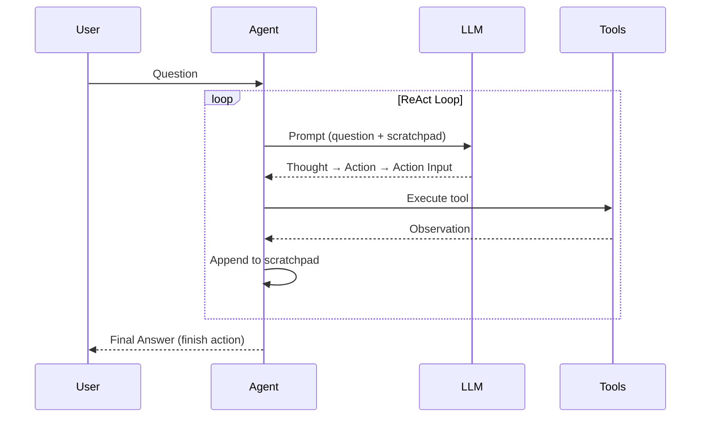

# ReAct Agent — Day 4

## What is ReAct?

**ReAct** (Reasoning + Acting) is a prompting technique where an LLM interleaves reasoning traces with tool actions. Instead of just thinking through a problem, the model explicitly outputs:

1. **Thought** — reasoning about what to do next
2. **Action** — which tool to call
3. **Action Input** — the argument for that tool
4. **Observation** — the result returned by the tool

This creates a loop: the agent builds a "scratchpad" of its entire reasoning history, reading past observations before deciding the next step.

## Why it matters

- **Transparency** — you can see the agent's reasoning step by step
- **Self-correction** — if a tool returns an error, the agent can adjust
- **Multi-step problems** — breaks complex questions into manageable steps
- **No fine-tuning needed** — works with any LLM via prompting

## This implementation

The agent has three tools:
- **search** — keyword search over a mock knowledge base
- **calculate** — safe math expression evaluator
- **get_date** — returns current UTC date/time

The loop terminates when the model outputs `finish` action with the final answer.

## Flow



## Usage

```bash
uv run python day4_react.py        # Start interactive REPL
uv run python day4_react.py demo   # Run demo questions
```
